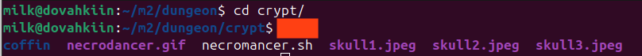
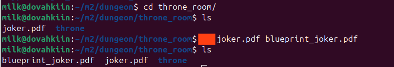
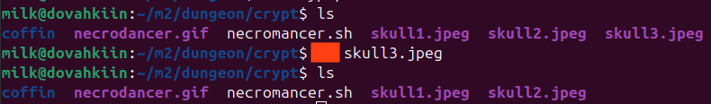
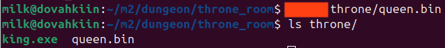
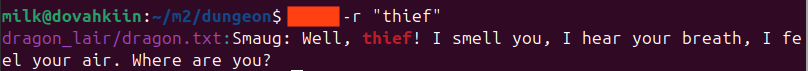
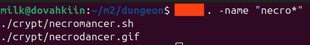

[](https://classroom.github.com/a/yi0reT4Z)
## What's that UNIX command?

For each image below, the command is blocked out. Write your answer as the UNIX command or keyword used to produce the output shown.

*All of the commands were done in this repository*

--- 


### Q1.


```
ls
```
--- 

### Q2.


```
cp
```
--- 

### Q3.


```
rm
```
--- 

### Q4.


```
touch
```
--- 

### Q5.


```
grep
```
--- 

### Q6.


```
find
```
--- 

### Q7.


```
chmod
```
--- 
